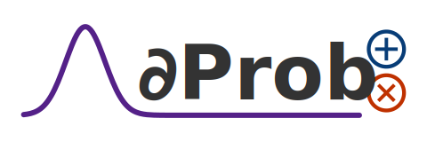

[](https://lbesson.mit-license.org/)
[](https://badge.fury.io/py/deeprob-kit)



## Abstract
DeeProb-kit is a Python library that implements deep probabilistic models such as various kinds of
**Sum-Product Networks**, **Normalizing Flows** and their possible combinations for probabilistic inference.
Some models are implemented using **PyTorch** for fast training and inference on GPUs.

## Features
- Inference algorithms for SPNs. <sup>[1](#r1) [4](#r4)</sup>
- Learning algorithms for SPNs structure. <sup>[1](#r1) [2](#r2) [3](#r3) [4](#r4)</sup>
- Chow-Liu Trees (CLT) as SPN leaves. <sup>[11](#r11) [12](#r12)</sup>
- Batch Expectation-Maximization (EM) for SPNs with arbitrarily leaves. <sup>[13](#r13) [14](#r14)</sup>
- Structural marginalization and pruning algorithms for SPNs.
- High-order moments computation for SPNs.
- JSON I/O operations for SPNs and CLTs. <sup>[4](#r4)</sup>
- Plotting operations based on NetworkX for SPNs and CLTs. <sup>[4](#r4)</sup>
- Randomized And Tensorized SPNs (RAT-SPNs) using PyTorch. <sup>[5](#r5)</sup>
- Masked Autoregressive Flows (MAFs) using PyTorch. <sup>[6](#r6)</sup>
- Real Non-Volume-Preserving (RealNVP) and Non-linear Independent Component Estimation (NICE) flows. <sup>[7](#r7) [8](#r8)</sup>
- Deep Generalized Convolutional SPNs (DGC-SPNs) using PyTorch. <sup>[10](#r10)</sup>

The collection of implemented models is summarized in the following table.
The supported data dimensionality for each model is showed in the **Input Dimensionality** column.
Moreover, the **Supervised** column tells which model is suitable for a supervised learning task,
other than density estimation task.

| Model      | Description                                        | Input Dimensionality | Supervised |
|------------|----------------------------------------------------|:--------------------:|:----------:|
| Binary-CLT | Binary Chow-Liu Tree (CLT)                         |           D          |      ❌     |
| SPN        | Vanilla Sum-Product Network, using LearnSPN        |           D          |      ✔     |
| RAT-SPN    | Randomized and Tensorized Sum-Product Network      |           D          |      ✔     |
| DGC-SPN    | Deep Generalized Convolutional Sum-Product Network | (1, D, D); (3, D, D) |      ✔     |
| MAF        | Masked Autoregressive Flow                         |           D          |      ❌     |
| NICE       | Non-linear Independent Components Estimation Flow  | (1, H, W); (3, H, W) |      ❌     |
| RealNVP    | Real-valued Non-Volume-Preserving Flow             | (1, H, W); (3, H, W) |      ❌     |

## Installation & Documentation
The library can be installed either from PIP repository or by source code.
```shell
# Install from PIP repository
pip install deeprob-kit
```
```shell
# Install from `main` git branch
pip install -e git+https://github.com/deeprob-org/deeprob-kit.git@main#egg=deeprob-kit
```
The documentation is generated automatically by Sphinx (with Read-the-Docs theme), and it's hosted using GitHub Pages
at [deeprob-kit]().

## Datasets and Experiments
A collection of 29 binary datasets, which most of them are used in Probabilistic Circuits literature,
can be found at [UCLA-StarAI-Binary-Datasets](https://github.com/UCLA-StarAI/Density-Estimation-Datasets).

Moreover, a collection of 5 continuous datasets, commonly present in works regarding Normalizing Flows,
can be found at [MAF-Continuous-Datasets](https://zenodo.org/record/1161203#.Wmtf_XVl8eN).

After downloading them, the datasets must be stored in the `experiments/datasets` directory to be able to run the experiments
(and Unit Tests).
The experiments scripts are available in the `experiments` directory and can be launched using the command line
by specifying the dataset and hyper-parameters.

## Code Examples
A collection of code examples can be found in the `examples` directory.
However, the examples are not intended to produce state-of-the-art results,
but only to present the library.

The following table contains a description about them and a code complexity ranging from one to three stars.
The **Complexity** column consists of a measure that roughly represents how many features of the library are used, as well as
the expected time required to run the script.

|        Example       |                                    Description                                    | Complexity |
|----------------------|-----------------------------------------------------------------------------------|:----------:|
| naive_model.py       | Learn, evaluate and print statistics about a naive factorized model.              |      ⭐     |      
| spn_plot.py          | Instantiate, prune, marginalize and plot some SPNs.                               |      ⭐     |
| clt_plot.py          | Learn a Binary CLT and plot it.                                                   |      ⭐     |
| spn_moments.py       | Instantiate and compute moments statistics about the random variables.            |      ⭐     |
| sklearn_interface.py | Learn and evaluate a SPN using the scikit-learn interface.                        |      ⭐     |
| spn_custom_leaf.py   | Learn, evaluate and serialize a SPN with a user-defined leaf distribution.        |      ⭐     |
| clt_to_spn.py        | Learn a Binary CLT, convert it to a structured decomposable SPN and plot it.      |      ⭐     |
| spn_clt_em.py        | Instantiate a SPN with Binary CLTs, apply EM algorithm and sample some data.      |     ⭐⭐     |
| clt_queries.py       | Learn a Binary CLT, plot it, run some queries and sample some data.               |     ⭐⭐     |
| ratspn_mnist.py      | Train and evaluate a RAT-SPN on MNIST.                                            |     ⭐⭐     |
| dgcspn_olivetti.py   | Train, evaluate and complete some images with DGC-SPN on Olivetti-Faces.          |     ⭐⭐     |
| dgcspn_mnist.py      | Train and evaluate a DGC-SPN on MNIST.                                            |     ⭐⭐     |
| nvp1d_moons.py       | Train and evaluate a 1D RealNVP on Moons dataset.                                 |     ⭐⭐     |
| maf_cifar10.py       | Train and evaluate a MAF on CIFAR10.                                              |     ⭐⭐⭐    |
| nvp2d_mnist.py       | Train and evaluate a 2D RealNVP on MNIST.                                         |     ⭐⭐⭐    |
| nvp2d_cifar10.py     | Train and evaluate a 2D RealNVP on CIFAR10.                                       |     ⭐⭐⭐    |
| spn_latent_mnist.py  | Train and evaluate a SPN on MNIST using the features extracted by an autoencoder. |     ⭐⭐⭐    |

## Related Repositories
- [SPFlow](https://github.com/SPFlow/SPFlow)
- [RAT-SPN](https://github.com/cambridge-mlg/RAT-SPN)
- [Random-PC](https://github.com/gengala/Random-Probabilistic-Circuits)
- [LibSPN-Keras](https://github.com/pronobis/libspn-keras)
- [MAF](https://github.com/gpapamak/maf)
- [RealNVP](https://github.com/chrischute/real-nvp)

## References

<b id="r1">1.</b> Peharz et al. [*On Theoretical Properties of Sum-Product Networks*][Peharz2015]. AISTATS (2015).

<b id="r2">2.</b> Poon and Domingos. [*Sum-Product Networks: A New Deep Architecture*][PoonDomingos2011]. UAI (2011).

<b id="r3">3.</b> Molina, Vergari et al. [*Mixed Sum-Product Networks: A Deep Architecture for Hybrid Domains*][MolinaVergari2018]. AAAI (2018).

<b id="r4">4.</b> Molina, Vergari et al. [*SPFLOW : An easy and extensible library for deep probabilistic learning using Sum-Product Networks*][MolinaVergari2019]. CoRR (2019).

<b id="r5">5.</b> Peharz et al. [*Probabilistic Deep Learning using Random Sum-Product Networks*][Peharz2020a]. UAI (2020).

<b id="r6">6.</b> Papamakarios et al. [*Masked Autoregressive Flow for Density Estimation*][Papamakarios2017]. NeurIPS (2017).
   
<b id="r7">7.</b> Dinh et al. [*Density Estimation using RealNVP*][Dinh2017]. ICLR (2017).

<b id="r8">8.</b> Dinh et al. [*NICE: Non-linear Independent Components Estimation*][Dinh2015]. ICLR (2015).
   
<b id="r9">9.</b> Papamakarios, Nalisnick et al. [*Normalizing Flows for Probabilistic Modeling and Inference*][PapamakariosNalisnick2021]. JMLR (2021).
   
<b id="r10">10.</b> Van de Wolfshaar and Pronobis. [*Deep Generalized Convolutional Sum-Product Networks for Probabilistic Image Representations*][VanWolfshaarPronobis2020]. PGM (2020).

<b id="r11">11.</b> Rahman et al. [*Cutset Networks: A Simple, Tractable, and Scalable Approach for Improving the Accuracy of Chow-Liu Trees*][Rahman2014]. ECML-PKDD (2014).

<b id="r12">12.</b> Di Mauro, Gala et al. [*Random Probabilistic Circuits*][DiMauroGala2021]. UAI (2021).

<b id="r13">13.</b> Desana and Schnörr. [*Learning Arbitrary Sum-Product Network Leaves with Expectation-Maximization*][DesanaSchnörr2016]. CoRR (2016).
    
<b id="r14">14.</b> Peharz et al. [*Einsum Networks: Fast and Scalable Learning of Tractable Probabilistic Circuits*][Peharz2020b]. ICML (2020).

[Peharz2015]: http://proceedings.mlr.press/v38/peharz15.pdf
[PoonDomingos2011]: https://arxiv.org/pdf/1202.3732.pdf
[MolinaVergari2018]: https://www.aaai.org/ocs/index.php/AAAI/AAAI18/paper/viewFile/16865/16619
[MolinaVergari2019]: https://arxiv.org/pdf/1901.03704.pdf
[Peharz2020a]: http://proceedings.mlr.press/v115/peharz20a/peharz20a.pdf
[Papamakarios2017]: https://proceedings.neurips.cc/paper/2017/file/6c1da886822c67822bcf3679d04369fa-Paper.pdf
[Dinh2017]: https://arxiv.org/pdf/1605.08803v3.pdf
[Dinh2015]: https://arxiv.org/pdf/1410.8516.pdf
[PapamakariosNalisnick2021]: https://www.jmlr.org/papers/volume22/19-1028/19-1028.pdf
[VanWolfshaarPronobis2020]: http://proceedings.mlr.press/v138/wolfshaar20a/wolfshaar20a.pdf
[Rahman2014]: https://link.springer.com/content/pdf/10.1007%2F978-3-662-44851-9_40.pdf
[DiMauroGala2021]: https://openreview.net/pdf?id=xzn1RVTCyB
[DesanaSchnörr2016]: https://arxiv.org/pdf/1604.07243.pdf
[Peharz2020b]: http://proceedings.mlr.press/v119/peharz20a/peharz20a.pdf
